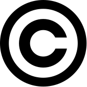
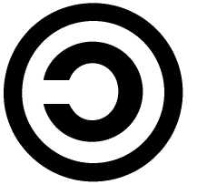
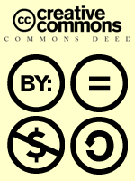
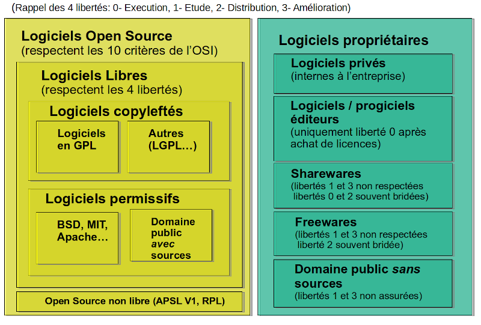

# Les licences logicielles

IUT de Nantes – Département Informatique

Cours de Licence Professionnelle 2021-2022

<small>[https://cours-licences.florat.net/](https://cours-licences.florat.net/)&nbsp;([version sur une page](./?print-pdf))&nbsp;/[sources](https://github.com/bflorat/cours-licences.github.io)</small>

Copyright © 2019-2022 <a href='http://www.florat.net/contact'>Bertrand Florat</a>. This work is licensed under a  <a rel="license" href="http://creativecommons.org/licenses/by-sa/4.0/">Creative Commons Attribution-ShareAlike 4.0 International License</a>.

<small><i>L'université de Nantes n’entend donner aucune approbation ni improbation aux opinions émises
dans ce cours.  Ces opinions doivent être considérées comme propres à l’auteur.</i></small>

---

## Agenda
| Contexte juridique | Licences propriétaires | Licences libres | Synthèse
| -------------| -------------|-------------|-------------|
| <li>les droits d'auteur <li>le copyright <li>le domaine public<li>les risques | <li>historique<li>fonctionnement<li>modèle économique| <li>historique<li>fonctionnement<li>modèle économique | <li>récapitulatif<li>analyse comparée
---

## Motivations 
* Puis-je réutiliser un bout de code trouvé sur StackOverflow ?
* Y-a-t’il une licence par défaut ?
* Qu'est ce que le Copyright, dois-je le mentionner ?
* A qui appartient le code que j’écris en entreprise ?
* Quelle différences entre Libre, Open Source et gratuit ?
* Puis-je intégrer du code libre dans un logiciel ?
* Quels risques juridiques pour mon entreprise ?
* Comment m'assurer que mon code ne sera pas contrefait ?
* Puis-je utiliser une librairie libre dans un logiciel propriétaire&nbsp;?
* J'utilise du code libre dans mon entreprise, dois-je redistribuer les modifications ?
---

## Contexte juridique 
* Le droit d'auteur, les droits patrimoniaux et moraux
* Les brevets logiciels
* Le domaine public
* Les licences logicielles
---

### Le droit d'auteur
* Ensemble des __droits d'un auteur sur ses œuvres de l'esprit et droits du public à en jouir sous conditions__
* Concept philosophique (John Locke, 17ème : l'homme étant propriétaire de lui-même, ses œuvres lui appartiennent)
* Deux types de droits : 
    - __*patrimoniaux*__ : droits limités dans le temps liés à l’exploitation économique de l’œuvre ;
    - __*moraux*__ : droits inaliénables et perpétuels liés à la réputation.
* Le plagiat est juridiquement nommé __*contrefaçon*__ en droit français. C'est le fait de faire passer pour sienne l'idée d'une autre personne
* Les articles [L335-2-1, L335-3](https://www.legifrance.gouv.fr/codes/article_lc/LEGIARTI000006279235/2009-06-14) du code de la propriété intellectuelle (__CPI__) interdisent de copier/utiliser le logiciel sans accord du titulaire des droits d'auteur
* __Par défaut__ (aucune licence explicite), __seul l'auteur a des droits__ sur sa création (“All Rights Reserved”) et les autres __aucun__

Attention : ne jamais utiliser de code sans licence explicite

---
## Comment prouver la paternité d'un logiciel&nbsp;?

* Il faut une __preuve *d'antériorité*__
* __Dépôt__ auprès de :
    - l'agence européenne APP (Agence pour la Protection des Programmes)
    - l'agence française INPI (Institut National de la Propriété Industrielle) via une enveloppe [e-Soleau](https://www.inpi.fr/fr/services-et-prestations/e-soleau) par exemple
* Dépôt à un notaire
* Courrier en recommandé à soi-même (moins sûr juridiquement)
* Émergent : l'horodatage par la __[Blockchain](https://www.app.asso.fr/centre-information/publications/blockchain-et-propriete-intellectuelle)__

---
## Les droits patrimoniaux du logiciel en France
* Valables 70 ans après l’année de décès de l’auteur ou du dernier auteur si travail collaboratif (article L122-6 du CPI)
  * Droits exercés par l'auteur puis à son décès par d'éventuels ayants-droits
* Droit de __reproduction__ : dupliquer l’œuvre sur tout support qui en permet la communication au public
* Droit de __modification__ : s'opposer à la traduction, adaptation ou toute autre modification du logiciel
* Droit de __mise sur le marché__ : l'auteur peut vendre ou donner son œuvre à sa guise

<b>Œuvre réalisée sous contrat de travail</b> : Les droits d'auteur patrimoniaux appartiennent à l'employeur (article L113-9 du CPI)

    
---

## Les droits moraux du logiciels en France
* Perpétuels (après la mort de l'auteur, revient aux ayants-droits)
* Aménagés (à la baisse) pour les logiciels
* Quatre attributs théoriques pour une œuvre :
    * droit __de paternité__ (même si les droits d'exploitations ont été cédés [affaire Framatome 1993])
    * droit au __respect__ de l'œuvre : possible de s'opposer à toute modification préjudiciable à son honneur ou à sa réputation
    * droit à la __divulgation__ (décider du moment et des conditions pour rendre l'œuvre publique)
    * droit de __retrait ou repentir__ (stopper la divulgation à condition d'indemniser du préjudice)

Pour un logiciel, sauf clauses contractuelles spécifiques, <b>seuls les droits de respect / de paternité sont réellement applicables (jurisprudence).</b>

    
---

## Le Copyright
* Le droit d'auteur est appliqué dans les pays Européens (hors UK et Irlande) et le Copyright dans les pays anglo-saxons (USA, Canada, ...) 

    - Droit d'auteur : avant tout protection des _auteurs_
    - Copyright : avant tout protection des _œuvres_
* Harmonisation par __convention de Berne__ (1971), ratifiée par 166 états
  * __Obtention gratuite et automatique__ du droit d'auteur 
  * Il faut demander explicitement une renonciation à son droit d'auteur

La notice "Copyright ©" est encore largement utilisée à titre informatif uniquement (rappelle la protection juridique)

    
---

## Les brevets 
* Le droit d'auteur/copyright concerne _des œuvres_
* Les brevets concernent _des inventions_
* Le brevet est une propriété industrielle : donne le droit d'exploiter une invention
* En France, les logiciels ne sont pas brevetables (L 611-10 du CPI, loi du 2 janvier 1968), pas de caractère industriel
* Interdiction réaffirmée au niveau européen en 2005 (après une longue lutte notamment des mouvements du Logiciel Libre)
* Exception : logiciels au sein d'une invention non logicielle brevetable (exemple : ABS dans un véhicule)
---
## Le domaine public
* Toute création pour laquelle aucun droit d'auteur ne s'applique pour différents raisons :

    
    - expiration ;
    - renonciation ;
    - inapplicabilité (ex: les oeuvre datant d'avant le droit d'auteur en 1791 ou œuvres créées par un non humain comme [un animal](https://fr.wikipedia.org/wiki/Selfies_de_singe) ou une [IA](https://fr.wikipedia.org/wiki/Intelligence_artificielle_et_droit_d%27auteur_dans_l%27art) .

* Tout logiciel tombe dans le domaine public à l'échéance des droits patrimoniaux
* En droit français, il n'est pas possible de renoncer totalement à ses droits moraux
* Certaines licences permettent de renoncer à tout ce qui est permis par la loi du pays : licences WTFPLv2, Zero Clause BSD, CC0
---

## Les licences
* Contrats entre un ou plusieurs auteurs (ou leurs ayant-droits) et des utilisateurs
* L'auteur concède des droits contre rémunération ou à titre gracieux
* Exemple de droits : 
    - exécuter le logiciel ;
    - dupliquer le logiciel ;
    - le modifier...

---

### Des risques importants en cas de non respect des licences
* 2008 : Microsoft gagne 1.8&nbsp;M€ contre un réseau de contrefaçon (cour d'appel de Paris)
* 2009 : 8000&nbsp;€ de frais de justice pour Edu4 et perte du contrat pour avoir fait passé VLC (logiciel libre) comme un développement interne
* 2014 : Oracle demande 12 M€ à l'AFPA pour utilisation non prévue d'un de ses logiciels (mais Oracle a été débouté)
* 2017 : TGI de Bayonne : cinq pirates condamnés à 4.6 M€ + 12-18 mois avec sursis pour piratage à grande echelle de Windows XP.
* 2019-2021 : Procès de la Société Entr’ouvert contre Orange qui a utilisé sa librairie pour un projet DGME sans respecter sa licence (GPL V2). Perdu par Entr'ouvert en [2019](https://www.legalis.net/jurisprudences/tgi-de-paris-3eme-ch-3eme-section-jugement-du-21-juin-2019/) mais gagné en appel en [mars 2021](https://www.legalis.net/jurisprudences/cour-dappel-de-paris-pole-5-ch-2-arret-du-19-mars-2021/) (160K€ de dédommagement).
* Piratage de logiciels : le CPI prévoit jusqu'à 300.000&nbsp;€ d'amende et 3&nbsp;ans d’emprisonnement pour les personnes physiques et 750.000&nbsp;€ d'amende pour les personnes morales
---

## Les licences propriétaires
* Synonymes: "non libre", "privatif/privateur", "Closed Source"
* Licence définie par un CLUF
* L'objectif est de __contrôler la diffusion d'un logiciel__ pour en tirer un bénéfice
* Le code source n'est pas disponible (sauf exceptions contractuelles)
* __Location temporaire ou perpétuelle de droits d'usage__ contractualisée par un CLUF
  * Il s'agit de location et non achat comme souvent dit par abus de language
* Un logiciel peut être vendu à une autre société (transfert du droit d'auteur patrimonial)
    - Exemple : HP vend en 2016 son offre logicielle à Microfocus pour 8,8&nbsp;milliards de dollars US

    <b>CLUF : </b>Contrat de Licence Utilisateur Final 
    <b>EULA : </b>End User License Agreement en anglais

    
---

## Historique
* Jusqu'au milieu des années 1970 :
    - Pas encore de micro-informatique (seulement des mainframes)
    - Hardware et software vendus ensemble mais c'est surtout le hardware qui est important
    

        
        

            <a href="https://scientificwomen.net/women/hopper-grace-45">Grace Hopper, source : History of Scientific Women</a>
        

    

                                                                       
    - Les programmes sont principalement écrits par des femmes
    - Le code source est libre d'être étudié ou modifié (mais inutilisable sans le matériel associé)
* Milieu des années 1970 : 
    - Création du concept de logiciel propriétaire
    - Lettre de Bill Gates en 1976 demandant de cesser «&nbsp;le vol&nbsp;» des logiciels
    - Premières lois (_Copyright Act_) en octobre 1976 pour protéger les auteurs de logiciels
    - Rapidement, la majorité des logiciels devient propriétaire au début des années 1980
---

### Modèle économique de l'édition de logiciels propriétaires
* Les utilisateurs __payent pour pouvoir utiliser le logiciel__
* __Services__ (formation, support, conseil, mises à jour logicielles ou de données...)
* Peut être gratuit de façon définitive (Freeware) ou temporaire (Shareware)

Attention, freeware != logiciel libre (ici "free" signifie "gratuit")

     
* Les grands logiciels/progiciels proposent souvent plusieurs gammes du logiciel dont le prix croit avec les fonctionnalités :
    - Quelque fois la version de base gratuite (Freemium)
    - Puis versions « Silver », « Gold Elite », « Platinium » ou similaires
* Ordre de grandeur : 
    - Base Oracle Enterprise : [$47K /CPU](https://www.oracle.com/assets/technology-price-list-070617.pdf) minimum  + environ 20% de support par an
    - Les middlewares et base de données (Weblogic, Websphere, Oracle, MS Windows...) représentent dans les grands comptes des budgets de __dizaines à centaines de millions d'euros / an__
---

### les modes de facturation
* Critères principaux :
    - à l'utilisateur nommé
    - à un nombre d'utilisateurs simultanés (dits _flottants_)
    - à la puissance utilisée (PVU = _Processor Value Unit_) dépend du nombre cœurs et de leur caractéristiques
    - à l'installation (par serveur/station)
    - suivant les options utilisées (ex : partitionnement des bases Oracle).

* Rapidement très technique et complexe : 
    - Quid des machines virtuelles ?
    - Quid des containers ?
    - Quid des environnements hors production ?

* Donc besoin d'experts (métier de __Compliance Manager__) pour limiter les risques juridiques

---

### Quelques pièges courants du propriétaire
- Tarif négocié puis passage automatique au prix public si dépassement
- Fonctionnalité rapidement indispensable mais uniquement disponible dans une version plus chère (exemple : intégration à un fournisseur d'identités)
- Enfermement propriétaire (_vendor locking_). Ex : formats propriétaires.
- Contrats complexes favorisant l'utilisation d'options non incluses, puis audits
- Consommation "illimitée" au tarif négocié puis renégociation sur la nouvelle base tous les 5 ans
- Coûts de mises à jour ou les coûts de support très élevés
- Rabais sur des logiciels finalement pas utilisés
- Ventes (quasi) forcées. Ex : moteur BPM + serveur d'application
- Quid en cas de faillite (cas AGD) ?
    * prévoir _contrat d’escrow_ (sources déposées chez tiers de confiance)
    * pire si plateforme de développement (PaaS) : les applications sont inexploitables
- SaaS : prévoir contractuellement des solutions de réversibilité
- Favorise la [corruption](https://www.zdnet.fr/actualites/corruption-une-enquete-ouverte-contre-les-pratiques-commerciales-de-microsoft-en-hongrie-39872683.htm) / les pratiques peu éthiques (séminaires tous frais payés...)
---

### Méthodes de contrôle de la diffusion
* __Contrats__ (CLUF) engageant le client
* __Clés__ (fournies par l'éditeur et à installer)
* __Serveurs de licences__ (_on premise_)
* Appels d'__API__ sur Internet
* Hardware exécutant des binaires avec __DRM__ pour empécher les modifications (_tivoïsation_)
* __Audits__ par des consultants
* __Mouchards__ (dans les mises à jour par exemple)
---

### L'impact projet 
* Latences pour pouvoir __prototyper__ une solution logicielle
* __Délais__ liés à la signature du contrat 
* Dépendances quasi totale au __support__ de l'éditeur en cas de problème, peu/pas d'aide collaborative en ligne
* __Migrations forcées__ par l'éditeur (fin de support)
* __Coûts__ souvent très importants (100&nbsp;K€ à plusieurs M€)
    - limite souvent le budget développement dans les ESN
---

### L'impact sur l'architecture 
* __Incertitudes contractuelles__ liées à l'opacité des services achats
* __Risques sur la réversibilité__ (récupération des données)
* __Risque sur la disponibilité__ dans le cas de systèmes de validation de licences&nbsp;:
    - les serveurs de jetons peuvent devenir des SPOF
    - arrêt du service si oubli de renouveler une clé, etc.
* __Besoins d'accès à Internet__ depuis des serveurs (complexification / sécurité)
* Architecture pilotée par les coûts au lieu des exigences («&nbsp;pas de cluster, on n'a pas les moyens&nbsp;»)
* Contraintes sur les __environnements de développement__ et de recette («&nbsp;bidouilles&nbsp;» pour partager des licences entre développeurs)
* Peu adapté au __containers__

---

### Quels logiciels propriétaires n'ont pas ou peu d'équivalents libres ?
* La plupart des __firmwares__, logiciels industriels et embarqués
* __Progiciels métiers__ : ERP, médical, comptabilité, grande distribution...
* Outils de __conception avancés__ (exemple : CAO)
* Domaines de __niche__ (exemple : musique professionnelle, outils de compliance management...)

---

## Les logiciels libres
Définition ([Wikipedia](https://fr.wikipedia.org/wiki/Logiciel_libre)) :

 «&nbsp;*__Un logiciel libre est un logiciel dont l'utilisation, l'étude, la modification et la duplication par autrui en vue de sa diffusion sont permises, techniquement et légalement, ceci afin de garantir certaines libertés induites, dont le contrôle du programme par l'utilisateur et la possibilité de partage entre individus.__*&nbsp;» 

---

### Historique
* Des années 60 à mi-70, tous les logiciels était libres de fait 
* Mi-1970 : émergence des logiciels propriétaires et de la micro-informatique
* 1980 : Certains commencent à prendre conscience des restrictions des libertés

  * RMS (Richard Stallman) découvre qu'il n'a pas le droit de modifier un driver d'impression Xerox
* 1983 : Lancement du projet GNU (_Gnu’s Not Unix_) par RMS
* 1985 : Création de la FSF (_Free Software Fondation_)
* 1989 : Base légale du libre : la GPL V1 (_GNU General Public License_)
* 1991 : Linus Torvalds démarre le projet de noyau Linux
* 1994 : Sortie de Linux 1.0 en GPL v2, apparition du système GNU/Linux
* 1998 : Scission de l’Open Source Initiative (OSI) orientée business
* 2007 : GPL v3
---

### Les quatre libertés fondamentales
* __Liberté 0__ : La liberté d'__exécuter__ le programme, pour tous les usages et sans aucune restriction
* __Liberté 1__ : La liberté d'__étudier__ le fonctionnement du programme
* __Liberté 2__ : La liberté de __redistribuer__ le logiciel
* __Liberté 3__ : La liberté d'__améliorer__ le programme et de __redistribuer le programme amélioré__
---

### Définition de l'OSI (Open Source Initiative)

1. Free Redistribution
2. Source Code
3. Derived Works
4. Integrity of The Author's Source Code
5. No Discrimination Against Persons or Groups
6. No Discrimination Against Fields of Endeavor
7. Distribution of License
8. License Must Not Be Specific to a Product
9. License Must Not Restrict Other Software
10. License Must Be Technology-Neutral
---

### Le Copyleft
Afin d’assurer ces libertés, les logiciels Open Source se basent sur&nbsp;:
- (Toujours) le __droit d’auteur__ (_copyright_) qui prévient le plagiat 
                                                                   
- (Souvent) __la gauche d’auteur__ (_copyleft_) : complète le copyright, assure propagation des libertés par __réciprocité__ (ou “obligation de partage à l'identique”)
* Concept inventé par Don Hopkins et Richard Stallman en 1984
* Tout code à la base sous licence copyleft doit conserver sa licence d’origine
* Le copyleft impose que toute modification publiée apportée à un logiciel copyleft <ins>et distribuée</ins> soit versée à la communauté
* Pour les détracteurs (anciennement Microsoft par exemple) : «&nbsp;virus&nbsp;»

<b>“On ne partage qu'avec ceux qui veulent partager”</b>

                                                                    
---

### Limites à l'applicabilité du Copyleft
* Ne s'applique que si le logiciel est distribué ( _«&nbsp;Quand une organisation transfère des copies à d'autres organisations ou à des particuliers, c'est une distribution&nbsp;»_ ([voir cette FAQ](https://www.gnu.org/licenses/gpl-faq.fr.html#InternalDistribution))
* Il est donc possible (__bien que déconseillé__) de modifier du code GPL __en interne__ sans redistribuer les modifications

Dans les faits, difficilement applicable car le logiciel d'origine évolue et il faut merger ses modifications si on veut profiter de ses évolutions

* Il est aussi possible (__bien que fortement déconseillé__) d'intégrer du code GPL dans un logiciel __interne__ de licence incompatible (propriétaire par exemple) à condition de ne pas distribuer ce logiciel

Etre <b>TRES prudent</b> car cela peut mettre l'entreprise à risque en cas de changement de situation du logiciel (par exemple si l'organisation décide de vendre un logiciel précédement purement interne sans savoir qu'il contient du code GPL)

---

### Niveau de copyleft par licence
| Aucun | Par fichier | Niveau librairie | Fort | Etendu
|----|----|----|----|----
|BSD, Apache, MIT, ISC, CeCILL B, WTFPL | CDDL, Mozilla Public Licence (MPL), CeCILL C | LGPL | GPL, CeCILL | AGPL
|On peut partager les modifications sous des conditions différentes | Possible d'inclure du code dans tout logiciel mais copyleft sur [_ce_ fichier](https://www.mozilla.org/en-US/MPL/2.0/FAQ/) | Possible de lier une telle bibliothèque depuis tout logiciel mais une modification de la bibliothèque elle-même est copyleftée | Le logiciel et ses dépendances sont copyleftés. Seul les éléments système comme l'OS n'ont pas à l'être | Idem GPL mais valable aussi lorsque le logiciel s'exécute à distance (application Web)
---

### Zoom sur la GPL (GNU General Public License)
* Objectif: assurer la __liberté des utilisateurs__
* Créée par RMS (Richard Stallman) et la FSF
* V1 en 1989, V2 en 1991, V3 en 2007
* Meilleure garantie des libertés des utilisateurs et la redistribution de la connaissance grâce au copyleft
* V3 : 
    - anti-tivoïsation (GPL mais DRM empêchant modification)
    - possibilité permissions additionnelles (exceptions)
    - simplification des compatibilités avec les autres licences

Très utilisée. Exemples : <b>Linux, Git, Ansible, Drupal, Wordpress, Notepadd++, MariaDB, GCC</b>

---
### Zoom sur la LGPL (Lesser General Public License)
* Objectif : assurer la liberté des utilisateurs et __permettre de distribuer des programmes propriétaires liés avec des bibliothèques libres__
* Créée par RMS (Richard Stallman) et la FSF en 1991 puis revue en 1999
* Les modifications d’une bibliothèque LGPL ne peuvent être redistribuées qu’en LGPL
* V3 en 2007 avec mêmes avancées que la GPL

Exemples : <b>JFreechart, JasperReports, GTK, Hibernate, librairie GNU C++…</b>

                                                                    
---

### Zoom sur l'AGPL (Affero General Public License)
* Objectif: __Obliger les services accessibles par le réseau à publier le code source de leurs améliorations__
* V3 en 2007

Exemples : <b>BerkeleyDB, Ghostscript, iText, Mattermost, MongoDB jusqu'en 2018, Nextcloud, OnlyOffice, JasperReports Server</b>

---
### Zoom sur la licence CeCILL
* Écrite par le CEA CNRS INRIA Logiciel Libre
* Licence issue de la Recherche française, adaptation de la GPL au droit français
* Licence en français et en anglais, pouvant être utilisée partout dans le monde. En cas de litige, le droit français s’applique.
* V1 en 2004, V2 en mai 2005, CeCILL-B et CeCILL-C en 2006
* Complètement compatible GPL (donc copyleftée)
* Il est possible de redistribuer du code CeCILL en GPL

Exemples : <b>Scilab, VLDocking Framework</b>

Variantes CeCILL-B (BSD-like) et CeCILL-C (MPL-like) <a href="https://directory.fsf.org/wiki/License:CeCILL-B">déconseillées par la FSF</a>)

                                                                                                  
---

### Zoom sur les licence OUVERTE

#### Code 
* Licence [OUVERTE V2](https://www.etalab.gouv.fr/wp-content/uploads/2017/04/ETALAB-Licence-Ouverte-v2.0.pdf) prévue pour le code produit par les administrations 
* Géré par ETALAB (administration en charge notamment de l'Open Data français)
* V2 en 2017

#### Données
Pour les bases de données (Open Data), licence [ODbL v1](https://spdx.org/licenses/ODbL-1.0.html#licenseText) copyleftée, c'est à dire avec obligation de partage à l'identique.

Les administrations peuvent utiliser d'autres licences, liste autorisée <a href='https://www.data.gouv.fr/fr/pages/legal/licences/'>ici.</a>

---

### Les licences permissives
* Dites aussi _lax_ ou _liberal_
* Les plus courantes : __BSD__, __MIT__, __Apache__
* Pas de copyleft
* Clauses de publicité des auteurs (attribution)
* Clause de conservation des notices de licences
* Excellente compatibilité entre les licences permissives et lors d'utilisation par un logiciel en licence copyleft ou un logiciel propriétaire

Attention : ce n'est pas du domaine public !)

---

### Droits et devoirs des auteurs
* Droits
    - Le droit d’auteur s'applique : il n’y __aucune perte de propriété__
    - Les auteurs ont le droit de __changer la licence__ des futures versions ou d’utiliser plusieurs licences pour toute version ancienne ou future leur appartenant
    - L’auteur a le droit (il est même encouragé) de tirer __profit__ pécuniairement de sa création, sans limite supérieure du prix.
* Devoirs
    - Les auteurs doivent __fournir le code source__ gratuitement ou contre rémunération (limitée au prix de la copie binaire)
    - __Responsabilité limitée__ : les licences libres possèdent toutes des clauses de dégagement de responsabilité (tout comme la quasi-totalité des logiciels propriétaires)
---

### La compatibilité des licences
* Certaines licences sont compatibles entre elles
* Décrit la possibilité ou non de mélanger du code source ou des binaires sous licences différentes
* Une licence A est réputée compatible avec une licence B si on peut intégrer du code de licence A dans un programme de licence B
* Il est possible de mixer du code de licences différentes dans un même fichier mais il faut garder toutes les notices de licence en entête

<i>Une flèche de A vers B indique que A est compatible avec B. La relation est transitive, donc par exemple la licence ISC est compatible avec la GPL v3.</i>

Attention : pas de bijection

Licence A compatible avec B n'implique pas B compatible avec A

---

### Le multi-licences
* Un même produit peut disposer de plusieurs licences (_Multi-licensing_)
* Licence multiple : libre/libre ou libre/propriétaire (exemple: MySQL Community en GPL et MySQL Enterprise Edition propriétaire)
* Soit l'utilisateur peut choisir la licence qui s’applique, soit l'auteur l'impose, soit toutes les licences s'appliquent en même temps
* En général utilisé par des __sociétés__, pas des communautés
* Objectifs : 
    - S’__assurer un revenu__ en vendant un logiciel en mode propriétaire tout en le faisant évoluer via la communauté (exemples : Mono, MySQL, QT)
    - Résoudre des incompatibilités de licence lors d’une fusion
    - __Segmentation de marché__ (version Community / Enterprise...)
* Risqué car __brouille la visibilité__ du projet et peut décourager les contributeurs ou conduire à un fork (MariaDB, LibreOffice, NextCloud...).
---

### Les exceptions (1/2)
* Une exception à une licence libre est un texte accordant des droits supplémentaires à l’utilisateur par rapport à la licence d’origine
* Exemple : GNU classpath 
>"Linking this library statically or dynamically with other modules is making a combined work based on this library. Thus, the terms and conditions of the GNU General Public License cover the whole combination.
<b>As a special exception, the copyright holders of this library give you permission to link this library</b> with independent modules to produce an executable, regardless of the license terms of these independent modules"
---

### Les exceptions (2/2)
* [Qt](https://doc.qt.io/archives/4.3/license-gpl-exceptions.html) : Permet de lier la bibliothèque QT (GPL) depuis la plupart des licences Open Source (BSD...)
>"As a special exception to the terms and conditions of version 2.0 of the GPL, Trolltech hereby grants you the rights described below, provided you agree to the terms and conditions in this Exception, including its obligations and restrictions on use. [...] 1) The right to use Open Source Licenses not compatible with the GNU General Public License: You may link software (hereafter referred to as "Your Software") against the Licensed Software and/or distribute binaries of Your Software linked against the Licensed Software [...]"
---

### Les licences orientées contenu (1/2) : La GFDL
* Gnu Free Documentation License
* Équivalent à la GPL pour les contenus documentaires
* Fondé sur le copyright et le copyleft
* Peu utilisée, globalement remplacée par les licences CC
* Incompatible avec la GPL 
    - interdiction d’insérer des documents GFDL dans un programme GPL
---

### Les licences orientées contenu (2/2) : Les licences Creative Commons

pour : documents, musique, images, photos…

|Licence        | Caractéristiques                                                                  | Libre&nbsp;?
|---------------|-----------------------------------------------------------------------------------|-------------
| _CC BY_       | paternité (by)                                                                    | Oui
| _CC BY-SA_    | paternité / partage des conditions à l'identique (Share Alike)                    | Oui
| _CC BY-ND_    | paternité / pas de distribution d'adaptation (Non Derivs)                         | Non
| _CC BY-NC_    | paternité / pas d'utilisation commerciale (Non Commercial)                        | Non
| _CC BY-NC-SA_ | paternité / pas d'utilisation commerciale / partage des conditions à l'identique  | Non
| _CC BY-NC-ND_ | paternité / pas d'utilisation commerciale / pas de modification                   | Non

[→ Choisir la meilleure licence Creative Commons](http://creativecommons.org.au/content/licensing-flowchart.pdf)

---

## Le code trouvé sur Internet
* __StackOverflow__ : Tout le code est en licence documentaire __[CC BY-SA](https://stackoverflow.com/help/licensing)__ (version de 2.5 à 4.0 suivant la date des posts)
    - La CC BY-SA 4.0 est <a href='https://creativecommons.org/2015/10/08/cc-by-sa-4-0-now-one-way-compatible-with-gplv3/'>comptatible avec la GPL V3</a> même si son utilisation pour du code est déconseillé par la FSF (pour éviter de multiplier le nombre de licences)
    - Devant un tribunal, possible de plaider le «&nbsp;Fair trade&nbsp;» (code trivial si quelques lignes) mais jurisprudence au cas par cas...
* Les sites qui ne précisent pas de licence : le __copyright par défaut « All rights reserved »__ s'applique
    - Il est néanmoins possible de demander une __autorisation écrite à l'auteur__
    - Sinon, il faut __réécrire complètement le code__
---

### Modèle économique du libre
* Sociétés (éditeurs, __SSLL__ = Sociétés de Service en Logiciels Libres) :
    - Services (formation, support, conseil)
    - Produits Open Core (Exemple : Gitlab CE, Kafka, Elastic, Redis)
    - SaaS (Software As A Service)
    - Investissements gouvernementaux (exemple: [Squash TM](https://www.squashtest.com/about))
    - Faire payer le programme ou ses sources (théorique)

* Organisations et bénévoles : 
    - Rémunérations très faibles en général (ex: dons)
    - Crowdsourcing
    - Rémunération forfaitaire pour développement spécifique (Bounty)
    - Don de matériel (serveurs, postes de développement etc..)
    - Merchandising (t-shirts...)
    - Surtout des motivations intrinsèques (sans retour directs) : créativité, liberté, altruisme, réputation/CV,...

Le marché mondial de l'Open Source atteint environ <b>57&nbsp;Mrds de $ en 2020</b> (Source Suyati Technologies)

---

### Les pièges les plus courants du libre
* Subir les __roadmap produit__ (surtout si produit d'entreprise)
* Partir sur une technologie peu supportée puis abandonnée
    - le plus important : __nombre d'utilisateurs effectifs__
* Solution gratuite mais __support exorbitant ou contraignant__
* Penser que nos __Merge Requests__ seront toujours prises en compte
* __Risques juridiques__ si non respect des licences
* Risques de __changement de licence__ (exemple: MongoDB en 2018)
---

## Synthèse

---

### Récapitulatif des familles de licences

Voir aussi [la liste officielle sur gnu.org](https://www.gnu.org/licenses/license-list.html)
---

### Analyse SWOT des licences propriétaires

| &nbsp; |&nbsp;
|--------|------
| __Forces__ <li>Service de support toujours proposé<li>Vulnérabilités masquées aux attaquants<li>Seule option pour de nombreux progiciels |  __Faiblesses__ <li>Support et licences onéreux<li>Support pas toujours au niveau ni réactif <li>Complications planning et architecture<li>Sécurité par l'obscurité <li>Risques juridiques (besoin d'experts)
| __Opportunités__<li>Créer un partenariat de longue durée avec un éditeur|  __Risques__ <li>Vendor locking <li> Subir les roadmaps<li>Impossible de connaître la véritable qualité ou la sécurité du code <li>Risques financiers (audits...)<li>Miser sur un produit en perte de vitesse<li>Faire de l'architecture pilotée par le coût
| &nbsp; |&nbsp;

---

### Analyse SWOT des licences libres

| &nbsp; |&nbsp;
|--------|------
| __Forces__ <li>Sécurité par l'auditabilité <li>Support communautaire réactif<li>Gratuit (hors support payant)<li>Simple à mettre en œuvre <li>Bonne pérénité tant qu'il y a des utilisateurs|  __Faiblesses__ <li>Failles de sécurité potentiellement visibles<li>Support payant onéreux 
| __Opportunités__<li>Contribuer (évolutions/corrections)<li>Tester facilement de nouvelles solutions (POC)<li>Changer facilement de solution |  __Risques__ <li>Risque juridique si non respect des licences<li>Subir les roadmaps<li>Miser sur un projet dont la communauté se désintéresse
| &nbsp; |&nbsp;

---

## Références

* Cours "Les licences logicielles" IUT de Nantes par Damien Raude-Morvan
* Liste SPDX de toutes les licences : https://spdx.org/licenses/
* https://www.usine-digitale.fr/article/audit-de-licences-logicielles-la-bataille-continue.N381077
* https://www.cncpi.fr/ba-ba/FAQ_questions_reponses/Comment_peut-on_proteger_un_logiciel/
* https://www.legalstart.fr/fiches-pratiques/proteger-une-creation/protection-logiciel/
* https://www.gnu.org/licenses/gpl-faq.fr.html
* https://philippe.scoffoni.net/agpl-resout-tous-les-probleme-open-souce-et-cloud-computing/
* https://en.wikipedia.org/wiki/Permissive_software_license
* https://fr.wikipedia.org/wiki/Domaine_public_(propri%C3%A9t%C3%A9_intellectuelle)
* https://cecill.info/licences.fr.html
* https://en.wikipedia.org/wiki/Business_models_for_open-source_software
* https://www.eurostaffgroup.com/media-hub/how-can-i-use-code-snippets-found-on-stack-overflow-65809/
* https://www.app.asso.fr/centre-information/base-de-connaissances/code-logiciels/la-protection-du-logiciel-par-le-droit-dauteur/contenu-de-la-protection
